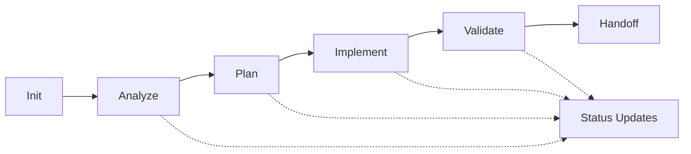

# Claude Tasks Workflow

A structured prompt-based workflow system for managing software development tasks using Claude AI assistant. This repository provides standardized templates for task analysis, planning, implementation, and handoffs that maintain consistency and reduce context loss across project phases.

## Overview

The Claude Tasks Workflow transforms how development teams manage tasks by providing:

- **Structured Templates**: Markdown-based prompts that guide Claude through specific project phases
- **Consistent Documentation**: Standardized outputs for analysis, planning, and handoffs
- **Context Preservation**: Rich documentation that maintains technical context across team members
- **Phase-Gate Management**: Clear progression from analysis through implementation to validation

## Repository Structure

```
.claude/
├── commands/                    # Template library
│   ├── project/
│   │   ├── task/               # Core task lifecycle templates
│   │   │   ├── init.md         # Initialize new task
│   │   │   ├── analyze.md      # Root cause analysis
│   │   │   ├── plan.md         # Implementation planning
│   │   │   ├── implement.md    # Development guidance
│   │   │   ├── validate.md     # QA validation
│   │   │   └── status.md       # Status reporting
│   │   ├── meeting/            # Meeting facilitation
│   │   │   ├── standup-brief.md
│   │   │   └── tech-review.md
│   │   ├── workflow/           # Process management
│   │   │   ├── handoff.md
│   │   │   └── cancel.md
│   │   ├── jira/              # Integration templates
│   │   ├── ci/                # CI/CD validation
│   │   └── docs/              # Documentation updates
│   └── tasks/                  # Generated task folders
│       └── [TASK-ID]/         # Per-task documentation
│           ├── analysis.md
│           ├── plan.md
│           ├── handoff.md
│           └── ...
```

## Quick Start

### 1. Initialize a New Task

With Claude, use the init template:
```
"Run the task init command for UGP-1234 to set up the analysis phase."
```

This creates `.claude/tasks/UGP-1234/` with initial `analysis.md`.

### 2. Analyze the Issue

```
"Run the task analyze command for UGP-1234 and complete the root cause analysis."
```

Generates comprehensive technical analysis with:
- Root cause identification
- System impact assessment
- Risk evaluation
- Evidence documentation

### 3. Create Implementation Plan

```
"Run the task plan command for UGP-1234 to create the implementation strategy."
```

Produces detailed `plan.md` with:
- Architecture approach
- File-by-file change mapping
- Test strategy
- Performance considerations

### 4. Execute and Validate

Follow implementation and validation templates for consistent delivery.

## Core Task Lifecycle



### Phase Gates

- **Analysis → Planning**: Root cause identified, system impact documented
- **Planning → Implementation**: Architecture approved, file changes mapped
- **Implementation → Validation**: Code complete, tests passing
- **Validation → Handoff**: QA complete, documentation updated

## Template Categories

### Core Task Management
- `init.md` - Task initialization and folder setup
- `analyze.md` - Technical root cause analysis
- `plan.md` - Implementation architecture and strategy
- `implement.md` - Development execution guidance
- `validate.md` - Quality assurance validation

### Meeting Support
- `standup-brief.md` - Technical standup presentations
- `tech-review.md` - Architecture review preparation

### Process Management
- `handoff.md` - Knowledge transfer documentation
- `status.md` - Progress reporting and updates
- `cancel.md` - Task cancellation procedures

### Integration
- `jira/update.md` - Ticket management
- `ci/validate.md` - CI/CD pipeline validation
- `docs/update.md` - Documentation maintenance

## Usage Patterns

### With Claude Assistant

**Direct Command Execution:**
```
"Use the analyze template for PROJ-456 to investigate the database connection timeout issue."
```

**Contextual Analysis:**
```
"I need to plan the implementation for UGP-789. The analysis shows the issue is in the authentication middleware. Create a detailed plan.md."
```

### Manual Template Usage

1. Copy template content from `.claude/commands/`
2. Replace `$ARGUMENTS` with your task ID
3. Follow the structured checklist
4. Save output to `.claude/tasks/[TASK-ID]/[deliverable].md`

## File Naming Conventions

| Phase | File | Purpose |
|-------|------|---------|
| Analysis | `analysis.md` | Root cause and impact assessment |
| Planning | `plan.md` | Implementation strategy and file mapping |
| Implementation | `implementation.md` | Development progress tracking |
| Validation | `validation.md` | QA results and test coverage |
| Handoff | `handoff.md` | Knowledge transfer documentation |
| Status | `status.md` | Progress summaries and updates |

## Integration Examples

### Jira Workflow
```
"Update Jira ticket UGP-1234 based on the completed analysis and planning phases."
```

### CI/CD Integration
```
"Run CI validation for UGP-1234 and update the validation.md with results."
```

### Documentation Updates
```
"Update project documentation based on the architectural changes in UGP-1234."
```

## Best Practices

### Documentation Standards
- **Always include TASK-ID** in folder names and file references
- **One task per folder** - maintain clear separation
- **Phase-based progression** - complete each phase before advancing
- **Rich context preservation** - document decisions and rationale

### Claude Interaction
- **Be specific** - Reference exact template names and task IDs
- **Provide context** - Share relevant technical details
- **Iterate incrementally** - Use templates to build comprehensive documentation
- **Maintain consistency** - Follow established naming conventions

### Team Collaboration
- **Shared task folders** - All team members can access task documentation
- **Handoff preparation** - Use handoff.md for knowledge transfer
- **Status transparency** - Regular status.md updates for stakeholders

## Customization

### Adding New Templates

1. Create new `.md` file in appropriate `.claude/commands/` subdirectory
2. Follow existing template structure:
   - Clear title and purpose
   - Argument placeholders (`$TASK_ID`, `$DESCRIPTION`)
   - Prerequisites and phase gates
   - Step-by-step deliverables
   - Output file specifications

### Template Structure Example
```markdown
# Template Title

## Arguments
- `$TASK_ID` - Unique task identifier
- `$DESCRIPTION` - Brief task description

## Prerequisites
- [ ] Previous phase completed
- [ ] Required files exist

## Deliverables
1. Analysis of X
2. Documentation of Y
3. Output to `.claude/tasks/$TASK_ID/deliverable.md`

## Checklist
- [ ] Requirement 1
- [ ] Requirement 2
```

### Project-Specific Adaptations

Modify templates to include:
- Project-specific file paths
- Custom validation requirements
- Specialized documentation formats
- Integration with existing tools

## Advanced Workflows

### Multi-Task Dependencies
```
"Analyze the dependency chain between UGP-1234 and UGP-1235, then create coordinated implementation plans."
```

### Architectural Reviews
```
"Prepare a technical review presentation for UGP-1234 focusing on the database migration strategy."
```

### Risk Assessment
```
"Evaluate the risks in UGP-1234 implementation plan and suggest mitigation strategies."
```

## Troubleshooting

### Common Issues

**Missing Task Folder**
- Solution: Run `init.md` template first to create proper structure

**Incomplete Phase Documentation**
- Solution: Use appropriate phase template to fill documentation gaps

**Context Loss During Handoffs**
- Solution: Complete `handoff.md` with comprehensive technical context

### Template Debugging

- Verify argument substitution (`$TASK_ID` replacement)
- Check file path existence
- Validate prerequisite completion
- Ensure proper markdown formatting

## Contributing

### Template Improvements
- Enhance existing templates with better structure
- Add validation checklists
- Improve Claude instruction clarity

### New Template Development
- Follow established naming conventions
- Include comprehensive documentation
- Test with actual Claude interactions
- Provide usage examples

### Documentation Updates
- Keep README current with template additions
- Document new workflow patterns
- Share best practices and lessons learned

## License

Apache 2 License - See LICENSE file for details

## Support

For questions, issues, or contributions:
- Create GitHub issues for bugs or feature requests
- Submit pull requests for template improvements
- Share workflow examples and best practices

---

**Version**: 1.0  
**Last Updated**: August 2025  
**Compatibility**: Claude Sonnet 4, Claude Opus 4
